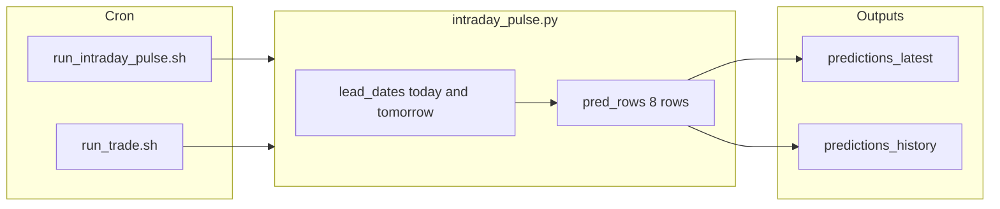

# Always Save Today and Tomorrow's Forecasts

## What’s wrong today

- **Cron never runs `run_daily`.** The crontab only runs:
  - **intraday_pulse** every 2 hours (12x/day) via [scripts/run_intraday_pulse.sh](scripts/run_intraday_pulse.sh) — `TRADE_DATE` = today.
  - **run_trade** at 7am via [scripts/run_trade.sh](scripts/run_trade.sh) — runs intraday_pulse then kalshi_trader; same `TRADE_DATE` = today.
- So the only automated writer of `predictions_latest` and `predictions_history` is **intraday_pulse**. If intraday was only writing **today** (lead 0), then 2/1 would never appear in the files until you manually ran `run_daily.py --trade-date 2026-02-01`.
- You want: **every run always saves today and tomorrow** so (1) the dashboard can show “next trade date” without manual runs, and (2) **predictions_history** has a time series of how tomorrow’s forecast changed (e.g. 2/1’s forecast at 1/31 00:00, 02:00, …, 22:00).

## Intended behavior (no edits in plan mode; this is the target)

| Run                | Who runs it                      | Dates to persist                                                                      | Where                                                                                                          |
| ------------------ | -------------------------------- | ------------------------------------------------------------------------------------- | -------------------------------------------------------------------------------------------------------------- |
| **intraday_pulse** | Cron every 2h + run_trade at 7am | **today + tomorrow**                                                                  | `predictions_latest` (overwrite), `predictions_history` (append 8 rows: 4 cities × 2 dates with same `run_ts`) |
| **run_daily**      | Manual (or future cron)          | **today + tomorrow** when no `--trade-date`; when `--trade-date D` given, **D + D+1** | `predictions_latest` (overwrite), `predictions_history` (append)                                               |

- **predictions_latest**: Always has at least two dates (e.g. 2026-01-31 and 2026-02-01). Dashboard and trade use this; no need to pass `--trade-date` to “get tomorrow.”
- **predictions_history**: Every run appends one row per (date, city) with `run_ts`. So for each future date (e.g. 2026-02-01) you get many rows (one per run), i.e. “how the forecast for 2/1 changed over time.”

## Current code state (already implemented in earlier sessions)

1. **intraday_pulse** ([intraday_pulse.py](intraday_pulse.py) ~1053–1055): The condition was changed from `if args.write_predictions and target_dt == trade_dt` to `if args.write_predictions`, so **both** lead_dates (today and tomorrow) are appended to `pred_rows`. Those rows are written to `predictions_latest` and appended to `predictions_history`. So **intraday already persists today + tomorrow** in the current codebase.
2. **run_daily** ([run_daily.py](run_daily.py) ~358–374): The loop runs `daily_prediction.py` for **both** `trade_dt` and `trade_dt + timedelta(days=1)`. So when you run `run_daily` **without** `--trade-date`, it uses `trade_dt = today` and writes **today + tomorrow** to `predictions_latest`; `_append_with_metadata` then appends that full file (8 rows) to `predictions_history`. So **run_daily already persists today + tomorrow** when run without `--trade-date`.

So the **logic** to “always save today and tomorrow” is already in place. The remaining problems are **deployment and clarity**.

## Why you still had to pass `--trade-date 2026-02-01`

- If the **Docker image** (or the code running in the container) was built **before** those two fixes, then:
  - Intraday was still only writing **today** to `pred_rows`, so `predictions_latest` and `predictions_history` never had 2/1 from cron.
  - You had to run `run_daily.py --trade-date 2026-02-01` to get 2/1 (and 2/2) into the files.
- So the fix is: **run with the updated code** (rebuild/restart so the container uses the repo that has the intraday and run_daily changes). No further code change is required for “always save today and tomorrow.”

## What to verify and optionally add (implementation steps)

1. **Confirm both code paths**
  - **intraday_pulse**: With `args.write_predictions`, `pred_rows` is built for **both** `lead_dates` ([intraday_pulse.py](intraday_pulse.py) ~928–934, ~1053–1099). `_write_predictions_latest(pred_rows)` and `_append_predictions_history(pred_rows, ...)` receive 8 rows (4 cities × 2 dates). No change needed if this matches your repo.
  - **run_daily**: Loop over `(trade_dt, trade_dt + timedelta(days=1))` and append to the same CSV ([run_daily.py](run_daily.py) ~358–374); then `_postprocess_voting` and `_append_with_metadata` run on the full file. No change needed if this matches your repo.
2. **Ensure scripts never force a single date**
  - [scripts/run_intraday_pulse.sh](scripts/run_intraday_pulse.sh): Uses `TRADE_DATE=$(today in TZ)`. No `--trade-date` override. Good.
  - [scripts/run_trade.sh](scripts/run_trade.sh): Same; runs intraday then kalshi_trader for that `TRADE_DATE`. Good.
  - Do **not** add a cron job that runs `run_daily.py --trade-date 2026-02-01` (or any fixed date). If you add run_daily to cron, run it **without** `--trade-date` so it always uses “today” and thus writes today + tomorrow.
3. **Optional: make the intent obvious**
  - In **intraday_pulse**: After `_write_predictions_latest` / `_append_predictions_history`, log one line, e.g.  
   `Saved forecasts for today and tomorrow (run_ts=...) so you can see how the forecast changes over time.`
  - In **run_daily**: After the prediction step, log, e.g.  
  `Predictions written for today and tomorrow; no need to pass --trade-date to get tomorrow.`
  - This does not change behavior; it only clarifies that today+tomorrow are always saved.
4. **Deploy**
  - Rebuild the Docker image from the repo that contains the intraday and run_daily changes, and restart the container (or ensure cron runs use that code). After that, every intraday run (and any run_daily without `--trade-date`) will persist today and tomorrow; you will not need to pass `--trade-date 2026-02-01` to get 2/1 in the files, and predictions_history will record how the forecast for tomorrow changed over time.

## Data flow (after fixes are deployed)

- **intraday_pulse** (TRADE_DATE=today): builds forecasts for today and tomorrow → writes 8 rows to `predictions_latest` (overwrite) and appends 8 rows to `predictions_history` (same `run_ts`). So you always have tomorrow in the files and a time series in history.
- **run_daily** (no `--trade-date`): runs daily_prediction for today and tomorrow → same 8 rows to `predictions_latest` and appended to `predictions_history`. You do not need to pass `--trade-date` to get tomorrow.

## Summary

- **Goal:** Always save today and tomorrow’s forecasts so the dashboard has the next trade date and you can see how the forecast changes over time.
- **Current code:** Intraday and run_daily already implement “today + tomorrow” in the repo you’ve been editing.
- **Why it didn’t work for you:** The container was likely running an older build that only wrote today; you had to run `run_daily.py --trade-date 2026-02-01` to get 2/1.
- **What to do:** Rebuild/restart so the container uses the updated code; optionally add the short log lines above for clarity. No further logic change is required for “always save today and tomorrow.”

