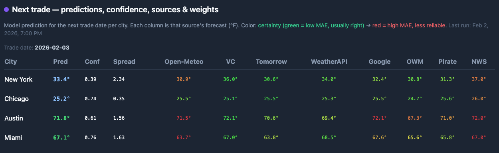

## Weather-trader (operational)

This repo predicts **daily maximum temperature** for 4 locations and maps the prediction into Kalshi "high temperature" markets for automated (or dry-run) trading.



### Inspiration and origin

Inspired by the [LSTM-Automated-Trading-System](https://github.com/pranavgoyanka/LSTM-Automated-Trading-System) repo (Kalshi Weather Prediction Common Task, BU CS542 Spring 2024). It reuses LSTM models, data pipeline (Open-Meteo, Visual Crossing, Meteostat, NOAA NCEI), and Kalshi trading, while adding provider-forecast blending, calibration, Docker scheduling, and richer operational tooling. Mapping: data fetching → `data_fetcher_new.ipynb` / `daily_prediction.py`; training → `train_models.py`; prediction → `daily_prediction.py` / `intraday_pulse.py`; trading → `kalshi_trader.py`. Models: `Data/model_<city>.keras`; cleaned data: `Data/prediction_data_cleaned_<city>.pkl`.

---

## Documentation

Visit these dedicated pages for full details — each link opens a dedicated doc with full content.

> [!Important] **Operational runbook**
> **[→ Open Operational runbook](documentation/operational_runbook.md)** — Autonomous operation, one-time setup, budget and live trading, idempotency, logs, generate predictions, dry-run, place orders.

> [!Important] **Docker setup**
> **[→ Open Docker setup](documentation/docker_setup.md)** — Prepare `.env`, mount Kalshi key, run container, logs, data persistence, schedule/timezone, 13:00 local gate.

> [!Tip] **Environment variables**
> **[→ Open Environment variables](documentation/environment_variables.md)** — Full table of required and optional env vars and secrets.

> [!Tip] **Dashboard**
> **[→ Open Dashboard](documentation/dashboard.md)** — Web UI and TUI: how to run, pages, observations.

> [!Tip] **Data flow**
> **[→ Open Data flow](documentation/data_flow.md)** — End-to-end: ingestion, cleaning, prediction modes, writing predictions, provider limits, weights/consensus, Kalshi budgeting and sigma.

> [!Tip] **Kalshi markets**
> **[→ Open Kalshi markets](documentation/kalshi_markets.md)** — Series tickers, NWS resolution, contract selection, authentication, dry-run.

> [!Note] **LSTM models**
> **[→ Open LSTM models](documentation/lstm_models.md)** — Training, input window, features, preprocessing.

> [!Note] **Mathematical foundations**
> **[→ Open Mathematical foundations](documentation/mathematical_foundations.md)** — Weights, sigma, probability, EV.

> [!Note] **System architecture**
> **[→ Open System architecture](documentation/system_architecture.md)**

> [!Note] **Data reference**
> **[→ Open Data reference](documentation/data_reference.md)** — Data files and schemas.

> [!Note] **Audit report**
> **[→ Open Audit report](documentation/audit_results.md)** — Risks and strengths.

> [!Note] **Improvement roadmap**
> **[→ Open Improvement roadmap](documentation/improvement_roadmap.md)**

> [!Caution] **Secrets and key rotation**
> **[→ Open SECURITY.md](SECURITY.md)** — Purging history, rotating keys, deleting cache files.

---

## Quick start

### Install

```bash
python -m venv .venv
source .venv/bin/activate
pip install -U pip
pip install -r requirements.txt
```

### Configure secrets

Copy `.env.example` → `.env` and fill in values. Minimum for trading: `KALSHI_API_KEY_ID`, `KALSHI_PRIVATE_KEY_PATH`, `KALSHI_ENV`. For full forecasts: add `VISUAL_CROSSING_API_KEY` and `NWS_USER_AGENT`.

> [!Tip] **Full env list:** [Environment variables](documentation/environment_variables.md)

Never commit `.env` or private keys. API keys can appear in SQLite cache files (`Data/*.sqlite`); see [SECURITY.md](SECURITY.md) if keys were exposed.

### Run with Docker (recommended)

```bash
docker compose up -d --build
```

> [!Important] **Next steps:** [Docker setup](documentation/docker_setup.md) (mount key, logs, schedule) · [Operational runbook](documentation/operational_runbook.md) (budget, live trading, commands)

---

## Cities / coordinates

| City | Code | Lat/Lon |
|------|------|---------|
| NYC (Central Park) | `ny` | 40.79736, -73.97785 |
| Chicago (Midway) | `il` | 41.78701, -87.77166 |
| Austin (Bergstrom) | `tx` | 30.14440, -97.66876 |
| Miami | `fl` | 25.77380, -80.19360 |

## Features

- **Prediction modes**: LSTM-only, provider-forecast-only, or blended. Multiple providers: Open-Meteo, Visual Crossing, Tomorrow.io, WeatherAPI, OpenWeatherMap, Pirate Weather, NWS.
- **Calibration**: Nightly job updates per-source MAE and writes `Data/weights.json`; consensus is MAE-weighted (or equal) across providers.
- **Intraday pulse**: Cron runs prediction snapshots and writes `predictions_latest.csv`; trade job runs at 13:00 local per city (ny/fl at 13:00 ET, il/tx at 14:00 ET).
- **Trading**: Orderbook-aware selection (EV-based), per-city sigma, budget allocation by confidence and historical MAE/hit-rate.
- **Dashboard**: Web and TUI — live NWS observations, next-trade predictions, Risk/Sell advisor, positions, analytics.

## Measurements (what we track)

| Artifact | Purpose |
|----------|---------|
| `Data/source_performance.csv` | Per-source prediction error vs NWS actual |
| `Data/daily_metrics.csv` | Rollups for allocation and scoring |
| `Data/eval_history.csv` | Per-trade outcome and market state |
| `Data/city_metadata.json` | Per-city historical MAE (used for σ) |

> [!Note] **Schemas and key fields:** [Data reference](documentation/data_reference.md)

---

## Notes / legacy

This repo originated from a BU CS542 common-task project. Historical trade logs and report screenshots remain (e.g. `Kalshi-Recent-Activity-Pranav.csv`, `CS542 Common Task Report .../`).

> [!Note] **Optimization and accuracy:** [Improvement roadmap](documentation/improvement_roadmap.md) · `ForecasterLearningImprovements.md`

---

## References

- [LSTM-Automated-Trading-System](https://github.com/pranavgoyanka/LSTM-Automated-Trading-System) — Kalshi Weather Prediction Common Task, BU CS542 Spring 2024
- [Keras Documentation](https://keras.io/guides/)
- [Predicting Temperature of Major Cities Using Machine Learning and Deep Learning](https://arxiv.org/abs/2309.13330)
