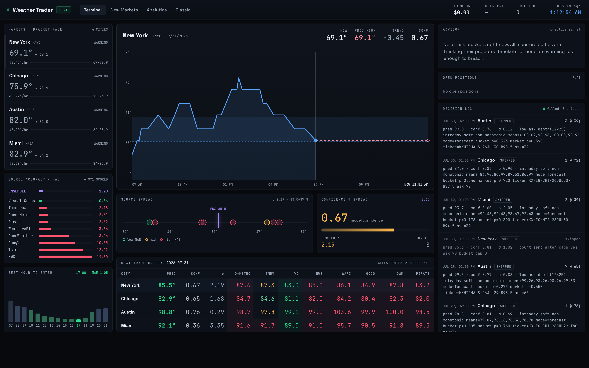

# Weather Trader — A Bloomberg-Style Terminal for Trading Weather on Kalshi

**A real-time trading terminal and automated bot for [Kalshi](https://kalshi.com) daily high-temperature markets.** One dark-mode dashboard puts every edge in front of you: the live bracket race for each city, the intraday projected-high chart, per-source forecast accuracy, open positions with live P&L, and the full decision log — the kind of at-a-glance command center weather traders normally build by hand.



If you're searching for **how weather prediction markets work**, how traders find an edge in **temperature contracts**, or how to **automate a weather-trading strategy** end to end, this repo is built for exactly that. Weather Trader pulls forecasts from eight weather sources, scores them continuously against NWS settlement truth, learns which sources and prediction modes are winning, and only takes trades that clear configurable risk guardrails — data, discipline, and automation instead of guessing.

---

## Why People Use This Repo

- Learn how a real weather prediction market workflow is built end to end.
- Study how traders can look for edge in data-rich, rules-based markets instead of relying on gut feel.
- Run a live dashboard, a paper-trading loop, and a fully automated pipeline on your own machine.
- Explore "how to bet on weather" in a technical, measurable way: forecasts in, probabilities out, orders gated by risk rules.

> [!IMPORTANT]
> This is research and automation code, not a promise of profit. Prediction markets are risky. The safest way to start is `KALSHI_ENV=demo` with `WT_SEND_ORDERS=false`.

---

## Quick Start in Demo Mode

```bash
cp .env.example .env      # fill in KALSHI_API_KEY_ID + KALSHI_PRIVATE_KEY_PATH
docker compose up -d --build
open http://localhost:8080  # live dashboard
```

Minimum required secrets: `KALSHI_API_KEY_ID`, `KALSHI_PRIVATE_KEY_PATH`, `KALSHI_ENV`.
Recommended first run: keep `KALSHI_ENV=demo` and `WT_SEND_ORDERS=false` until you trust the pipeline.

> [!IMPORTANT]
> **Setup guides:** [Docker setup](documentation/docker_setup.md) · [Operational runbook](documentation/operational_runbook.md) · [Environment variables](documentation/environment_variables.md)

Never commit `.env` or private keys. See [SECURITY.md](SECURITY.md) if secrets were exposed.

**Without Docker:** `pip install -r requirements.txt`, configure `.env`, run scripts manually. Scheduling is up to you.

---

## What It Does

### Multi-source weather forecast aggregation
Pulls daily high-temperature forecasts from **Open-Meteo, Visual Crossing, Tomorrow.io, WeatherAPI, OpenWeatherMap, Pirate Weather, NWS Weather.gov, and Google Weather**. Each source is scored continuously against NWS CLI settlement truth and reweighted nightly via inverse-MAE weighting.

### Kalshi weather market execution
Targets Kalshi daily high-temperature markets for **New York (KXHIGHNY), Chicago (KXHIGHCHI), Austin (KXHIGHAUS), and Miami (KXHIGHMIA)**. Selects the highest-EV bucket using a live orderbook snapshot, with confidence/spread guardrails and per-city daily budget controls.

### Contextual bandit model selection
A **LinUCB contextual bandit** (`bandit/`) learns which prediction mode performs best given real-time weather context (sky condition, cloud cover, provider disagreement, season). It selects between:
- **forecast** — raw MAE-weighted ensemble
- **blend** — bias-corrected forecast (adds per-city rolling cold-bias correction to the ensemble)

Context features include NWS/provider sky condition votes, cloud cover, spread, provider count, and city/date signals. Full decision and reward telemetry is logged for post-settlement learning.

### Self-calibrating bias correction
The system tracks signed prediction error per city over a 14-day rolling window. This `bias_correction_f` (stored in `Data/city_metadata.json`) is applied by the `blend` action to correct systematic cold-bias in the ensemble — typically **+0.4–0.6°F** across all four cities.

### Intraday refresh and trade gates
Forecasts refresh every hour. Trade decisions fire at **13:00 local time per city** (NY/FL at 13:00 ET, IL/TX at 14:00 ET). A second intraday pulse runs at 14:00 ET for remaining cities.

### Automated position exits (profit-taking + stop-loss)
Entries are only half the job — a bought position can drift from profitable to worthless as the day's temperature moves. `exit_manager.py` monitors open positions between entry and settlement and exits early when the odds turn, instead of holding every contract to a $0 or $1 settlement. It runs in two modes:

- **Morning positions** (`morning_entries.csv`) — obs-based danger exits, win-capture, and resting limit sells, checked 10:30–12:30 ET.
- **Daily-trade positions** (`--live`) — the 1–2 PM `run_trade.sh` orders are managed directly from Kalshi's live portfolio, checked every 30 min 13:30–18:00 ET, with two triggers:
  - **Obs bucket-breach stop-loss** — sells when the projected high moves outside the market's temperature bucket by `--danger-threshold-f` (default 1.5°F). *Example: a "79° or below" contract bought while the model liked it, then Chicago's projected high climbs to 86° — the position is sold near the current bid instead of settling to $0.*
  - **Trailing stop (take-profit)** — tracks the peak YES bid since entry and sells on a `WT_EXIT_TRAIL_CENTS` (default 10¢) retrace, once the position is up at least `WT_EXIT_TRAIL_ARM_GAIN_CENTS` (default 8¢). Locks in gains on a position that ran up before it fades.

Peak-bid state persists in `Data/exit_trailing_state.json`. Like the rest of the pipeline, the exit manager is **dry-run by default** and only places real sells when `WT_SEND_ORDERS=true`. Open positions and their live P&L are visible in the dashboard's **Open Positions** panel.

### Why that can matter in prediction markets
Weather markets are attractive because they settle on objective public data, update throughout the day, and often show visible disagreement between sources. This repo is built around that edge hypothesis: if you can measure forecast quality better than the market prices it, you may be able to find better entries than a casual trader.

---

## Cities

| City               | Code | Kalshi Series | Lat/Lon             |
| ------------------ | ---- | ------------- | ------------------- |
| NYC (Central Park) | `ny` | KXHIGHNY      | 40.79736, -73.97785 |
| Chicago (Midway)   | `il` | KXHIGHCHI     | 41.78701, -87.77166 |
| Austin (Bergstrom) | `tx` | KXHIGHAUS     | 30.14440, -97.66876 |
| Miami              | `fl` | KXHIGHMIA     | 25.77380, -80.19360 |

---

## Architecture

```
intraday_pulse.py          ← fetch forecasts, run bandit, write predictions_latest.csv
    └── bandit/policy.py   ← LinUCB selects forecast vs blend
    └── bandit/modes.py    ← blend = forecast + bias_correction_f
    └── bandit/context.py  ← sky/condition voting from provider payloads
kalshi_trader.py           ← read predictions, select market bucket, place orders
exit_manager.py            ← monitor open positions; obs bucket-breach + trailing-stop exits
calibrate_sources.py       ← nightly: update source weights from settled actuals
bandit_update.py           ← nightly: update bandit policy from settled rewards
update_city_metadata.py    ← nightly: update per-city MAE + rolling bias correction
```

---

## Data Artifacts

| File                                  | Purpose                                                        |
| ------------------------------------- | -------------------------------------------------------------- |
| `Data/source_performance.csv`         | Per-source signed and absolute error vs NWS actual             |
| `Data/city_metadata.json`             | Per-city MAE and rolling bias correction                       |
| `Data/weights.json`                   | Learned source weights (inverse-MAE)                           |
| `Data/eval_history.csv`               | Per-trade outcome, bucket hit, realized P&L                    |
| `Data/bandit_decisions_history.csv`   | Per-city bandit action selected and applied                    |
| `Data/bandit_rewards_history.csv`     | Post-settlement reward signal per action                       |
| `Data/bandit_state.json`              | Persisted LinUCB policy (A and b matrices)                     |

> [!NOTE]
> **Full schemas:** [Data reference](documentation/data_reference.md)

---

## Key Environment Variables

| Variable | Default | Description |
|---|---|---|
| `KALSHI_ENV` | `demo` | `demo` or `prod` |
| `WT_ENV` | `demo` | Trading environment passed to trader |
| `WT_SEND_ORDERS` | `false` | Set `true` to place real orders |
| `WT_DAILY_BUDGET` | `50` | Max dollars per day across all cities |
| `WT_BANDIT_MODE` | `live` | Bandit mode: `off` / `shadow` / `canary` / `live` |
| `WT_BANDIT_ALPHA` | `0.7` | LinUCB exploration parameter |
| `WT_EXIT_TRAIL_CENTS` | `10` | Trailing-stop: sell when YES bid retraces this many ¢ from its peak |
| `WT_EXIT_TRAIL_ARM_GAIN_CENTS` | `8` | Trailing-stop arms only once peak bid is this many ¢ above entry |

> [!TIP]
> **Full env var table:** [Environment variables](documentation/environment_variables.md)

---

## Documentation

> [!IMPORTANT]
> **[Operational runbook](documentation/operational_runbook.md)** — budget, live trading, idempotency, logs, dry-run, commands

> [!IMPORTANT]
> **[Docker setup](documentation/docker_setup.md)** — `.env`, Kalshi key mount, logs, schedule, timezone

> [!TIP]
> **[Data flow](documentation/data_flow.md)** — ingestion → consensus → prediction modes → Kalshi execution

> [!TIP]
> **[Kalshi markets](documentation/kalshi_markets.md)** — series tickers, NWS resolution, contract selection, authentication

> [!TIP]
> **[Dashboard](documentation/dashboard.md)** — web UI, TUI, observations, analytics

> [!TIP]
> **[Mathematical foundations](documentation/mathematical_foundations.md)** — weights, sigma, probability, EV

> [!NOTE]
> **[System architecture](documentation/system_architecture.md)** · **[Data reference](documentation/data_reference.md)** · **[Audit report](documentation/audit_results.md)** · **[Improvement roadmap](documentation/improvement_roadmap.md)**

> [!CAUTION]
> **[SECURITY.md](SECURITY.md)** — key rotation, purging git history, deleting cache files

---

## Weather Prediction Betting Intelligence

This section documents observed system performance, source quality, and the guardrail decisions made from live production data (Jan–Mar 2026). Numbers are derived from settled NWS CLI actuals vs. predictions logged at trade time.

### Observed Prediction Accuracy (MAE)

> **Corrected 2026-09-01.** Every accuracy figure previously published in this section was
> overstated by a label-leakage bug. Provider forecasts were graded against the *last*
> snapshot of the day — written at 23:00, after the day's high had already occurred — so
> sources were scored on how fast they converged to a known outcome rather than on how well
> they forecast at trade time. The numbers below are re-graded against the **09:00 same-day
> snapshot**, which is what the bot actually trades on. See
> `scripts/regrade_source_performance.py`.

**14-day rolling MAE by city** (consensus ensemble, graded at decision time):

| City | MAE (14d) | Mean signed bias | Bias correction applied |
|------|-----------|------------------|------------------------|
| Chicago (IL) | **1.45°F** | +0.18°F | Yes — `blend` mode |
| Austin (TX) | **1.89°F** | −1.89°F (runs cold) | Yes — `blend` mode |
| NYC (NY) | **1.95°F** | +1.17°F (runs warm) | Yes — `blend` mode |
| Miami (FL) | **3.40°F** | −2.89°F (runs cold) | Yes — `blend` mode |

Overall 14-day consensus MAE is **2.17°F** at 09:00; across the full re-graded history it
is **2.27°F**.

**But 09:00 is not when the bot buys.** Live orders go out at 13:00 ET (NY, Miami) and
14:00 ET (Chicago, Austin — 13:00 local). Accuracy improves materially in those four hours,
so the figures above understate the forecast the bot actually trades on:

| Snapshot hour | Consensus MAE | NY | IL | TX | FL |
|---------------|---------------|-----|-----|-----|-----|
| 09:00 | 2.21°F | 2.14 | 1.62 | 1.68 | 3.39 |
| 10:00 *(morning strategy, shadow-only)* | 2.18°F | 2.14 | 1.60 | 1.63 | **3.34** |
| **13:00 — live buy (NY, FL)** | **1.78°F** | 2.02 | 1.54 | 1.55 | **2.03** |
| **14:00 — live buy (IL, TX)** | **1.62°F** | 2.00 | 1.41 | 1.57 | **1.50** |

At the moment capital is actually committed, consensus MAE is **≈1.5°F**.

Miami is the outlier and the reason the morning strategy stays in shadow mode: at 10:00 its
MAE is 3.34°F, and by 14:00 it is 1.50°F — the *best* of the four cities. Sea-breeze
convection makes the Miami peak nearly unforecastable in the morning and quite tractable by
early afternoon. New York barely improves across the same window (2.14 → 2.00), so the value
of waiting is highly city-dependent.

The figures published before 2026-09-01 (0.67–0.87°F per city, ~1.0°F on stable days)
measured a 23:00 nowcast, not a forecast, and should not be used as a benchmark.

On weather-transition days (warm or cold fronts), errors of 3–7°F are possible. These are
not bugs — every provider fails simultaneously because the NWP models miss the front
timing. The guardrails below address this.

### Who To Trust — Live Source Leaderboard

Eight sources are scored continuously against NWS CLI settlement truth and reweighted via
inverse-MAE. From **6,864 scored** forecast/actual pairs, all graded at the 09:00 decision
hour:

| Rank | Source | MAE (°F) | Signed bias | Trust |
|------|--------|----------|-------------|-------|
| — | *Ensemble (blended)* | *2.27* | *−1.06* | *Reference — the weighted consensus the bot trades* |
| 1 | **Google Weather** | **2.28** | −1.64 | ✅ Sharpest single source |
| 2 | **Weather.gov (NWS)** | **2.29** | −0.81 | ✅ Statistically tied for sharpest |
| 3 | OpenWeatherMap | 2.48 | −0.58 | ✅ Lowest bias of any source |
| 4 | Visual Crossing | 2.60 | −1.47 | 👍 Solid mid-tier |
| 5 | Pirate Weather | 2.73 | −1.83 | 👍 Reliable background signal |
| 6 | Tomorrow.io | 2.91 | −1.17 | 👍 Solid mid-tier |
| 7 | Open-Meteo | 3.02 | −0.61 | 👍 Low bias, wider spread |
| 8 | WeatherAPI | 3.73 | **+2.21** | ⚠️ Runs warm — useful as a divergence flag, not a primary |
| — | ~~LSTM~~ | — | — | ❌ Retired (stale training data) |

**The learning:**

- **No single source beats the ensemble.** The blend (2.27°F) edges out the best individual
  feed, and the eight sources sit in a tight 2.3–3.7°F band. There is no oracle here — the
  diversification *is* the edge, which is exactly why the bot trades the blend.
- **The earlier "trust Visual Crossing above everything" advice was an artifact.** Its
  headline 0.86°F came from being graded at 23:00, when it had already converged on the
  realized high. At decision time it is a respectable mid-tier source, 4th of 8.
- **Weather.gov was never the worst — it was the most mis-measured.** Its published 14.80°F
  came from a second bug: when the NWS daytime period rolls off after ~19:00, the fetcher
  fell back to the *nighttime* period and returned the overnight low as if it were the
  daily high. Fixed; it now ranks joint-first.
- **Nearly every source runs cold.** Seven of eight under-predict the daily high, which is
  what the per-city `bias_correction_f` in `Data/city_metadata.json` exists to absorb.
  WeatherAPI is the lone warm outlier (+2.21°F) and is genuinely useful as a
  warm-front leading indicator.

### Source Weighting

Weights are recomputed nightly from a rolling 7-day inverse-MAE window, so they track recent
skill rather than sitting at fixed values. Representative weights after the 2026-09-01
re-grade:

| Source | Weight range across cities | Notes |
|--------|---------------------------|-------|
| **WeatherAPI** | 3–32% | Most city-dependent: top source in TX, weakest in NY |
| **Weather.gov (NWS)** | 6–25% | Top-weighted in IL and TX; was ~0% before the fetcher fix |
| **Google Weather** | 9–26% | Strongest in NY |
| **Open-Meteo** | 4–22% | Strong in IL |
| **Tomorrow.io** | 3–18% | Strong in NY |
| **Pirate Weather** | 7–17% | Reliable background signal |
| **OpenWeatherMap** | 8–12% | Lowest signed bias of any source |
| **Visual Crossing** | 7–11% | Consistent mid-tier across all cities |
| ~~LSTM~~ | **Retired** | Was 20–35°F off due to stale training data |

No source dominates, and the spread across cities is wide — a provider that leads in Texas
can be last in New York. That is the case for weighting per-city rather than globally.

### Guardrails and Trades Avoided

The system applies layered gates before any order is placed:

**1. Spread (sigma) guardrail** — skips if cross-source standard deviation exceeds 3.0°F.

**2. Max-source-divergence guardrail** (added Mar 2026) — if any single source deviates more than 3.0°F from the weighted consensus mean, sigma is widened to `max(sigma, max_deviation / 2)`. This lowers the confidence score and can trigger a skip even when most sources agree.

*Example: Feb 26 NYC.* Actual high was 49°F. All sources predicted 40.9–42.2°F except WeatherAPI at 46.4°F — a 4.5°F divergence from consensus. The original sigma was 1.09°F (sources appeared to agree), but with the divergence guardrail the effective sigma would have widened to 2.25°F, dropping `conf_final` to ~0.44 and **skipping a trade that lost -$2.82 on a 7.1°F miss**.

**3. Confidence threshold** — currently 0.60 (`effective_confidence = 0.7 × confidence + 0.3 × conviction`). Raised from 0.50 to 0.75 in Feb 2026 to reduce trading, lowered back to 0.60 in Mar 2026 after diagnosing that the 0.75 threshold was blocking legitimate trades on normal days.

**4. Intraday signal gate** — requires a stable or monotonically increasing prediction trend across the last four 30-minute pulses before allowing an order.

### What the Data Shows About Bad Trades

From 18 settled production trades (Feb 4 – Feb 28 2026):

| Scenario | Trades | Avg error | Notes |
|----------|--------|-----------|-------|
| Normal days (sources agree) | 14 | **1.05°F** | Sources within 2°F of each other |
| Outlier/transition days | 4 | **5.12°F** | Feb 18 TX cold snap, Feb 21 IL cold snap, Feb 25–26 NY warm front |

All four outlier trades shared the same root cause: **every provider simultaneously missed a front transition**. Three of the four had tight cross-source agreement (sigma < 2°F), which is why the spread guardrail didn't fire. The new divergence guardrail specifically addresses the Feb 26 NY case where WeatherAPI was signalling the warm move while the others were not.

Key observation: **later-in-the-day predictions are more accurate** (hour 15 averages 1.81°F MAE vs. 2.08°F at hour 13 across all settled data), because providers issue NWP model updates in the early afternoon. However, the system intentionally trades at 13:00 local time — by 15:00, Kalshi market liquidity drops significantly and the prices available no longer offer good value. The accuracy improvement is not worth the liquidity cost.

### Prediction Mode Performance

The contextual bandit chooses between two actions:

- **`forecast`** — raw MAE-weighted ensemble mean
- **`blend`** — `forecast + bias_correction_f` (adds the 14-day rolling signed bias to correct systematic under-prediction)

In the current production window, the bandit has predominantly selected `forecast` mode. As reward signal accumulates post-settlement, `blend` selection is expected to increase — the 14-day bias corrections (+0.5–0.9°F across cities) are directionally correct and the bandit's LinUCB policy will learn to exploit this in the appropriate sky/spread context.

---

## References

- [LSTM-Automated-Trading-System](https://github.com/pranavgoyanka/LSTM-Automated-Trading-System) — Kalshi Weather Prediction Common Task, BU CS542 Spring 2024
- [Predicting Temperature of Major Cities Using Machine Learning and Deep Learning](https://arxiv.org/abs/2309.13330)
- [Kalshi API Documentation](https://trading-api.readme.io/reference/getting-started)
