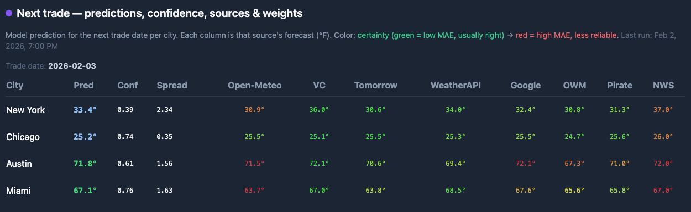

## Kalshi Weather Market Bot — Automated Daily High Temperature Trading

Weather Trader is an automated prediction market trading system for [Kalshi](https://kalshi.com) daily high-temperature contracts. It ingests real-time weather forecasts from eight providers, calibrates source weights nightly against NWS settlement truth, and executes EV-positive trades with a contextual-bandit model selection layer.

It doesn't just predict a temperature — it answers:
**which forecaster is right, for this city, in this condition regime, and by how much** — then sizes and places orders with guardrails.



---

## Quick Start

```bash
cp .env.example .env      # fill in KALSHI_API_KEY_ID + KALSHI_PRIVATE_KEY_PATH
docker compose up -d --build
open http://localhost:8080  # live dashboard
```

Minimum required secrets: `KALSHI_API_KEY_ID`, `KALSHI_PRIVATE_KEY_PATH`, `KALSHI_ENV`.

> [!IMPORTANT]
> **Setup guides:** [Docker setup](documentation/docker_setup.md) · [Operational runbook](documentation/operational_runbook.md) · [Environment variables](documentation/environment_variables.md)

Never commit `.env` or private keys. See [SECURITY.md](SECURITY.md) if secrets were exposed.

**Without Docker:** `pip install -r requirements.txt`, configure `.env`, run scripts manually. Scheduling is up to you.

---

## What It Does

### Multi-source weather forecast aggregation
Pulls daily high-temperature forecasts from **Open-Meteo, Visual Crossing, Tomorrow.io, WeatherAPI, OpenWeatherMap, Pirate Weather, NWS Weather.gov, and Google Weather**. Each source is scored continuously against NWS CLI settlement truth and reweighted nightly via inverse-MAE weighting.

### Kalshi prediction market execution
Targets Kalshi daily high-temperature markets for **New York (KXHIGHNY), Chicago (KXHIGHCHI), Austin (KXHIGHAUS), and Miami (KXHIGHMIA)**. Selects the highest-EV bucket using a live orderbook snapshot, with confidence/spread guardrails and per-city daily budget controls.

### Contextual bandit model selection
A **LinUCB contextual bandit** (`bandit/`) learns which prediction mode performs best given real-time weather context (sky condition, cloud cover, provider disagreement, season). It selects between:
- **forecast** — raw MAE-weighted ensemble
- **blend** — bias-corrected forecast (adds per-city rolling cold-bias correction to the ensemble)

Context features include NWS/provider sky condition votes, cloud cover, spread, provider count, and city/date signals. Full decision and reward telemetry is logged for post-settlement learning.

### Self-calibrating bias correction
The system tracks signed prediction error per city over a 14-day rolling window. This `bias_correction_f` (stored in `Data/city_metadata.json`) is applied by the `blend` action to correct systematic cold-bias in the ensemble — typically **+0.4–0.6°F** across all four cities.

### Intraday refresh and trade gates
Forecasts refresh every hour. Trade decisions fire at **13:00 local time per city** (NY/FL at 13:00 ET, IL/TX at 14:00 ET). A second intraday pulse runs at 14:00 ET for remaining cities.

---

## Cities

| City               | Code | Kalshi Series | Lat/Lon             |
| ------------------ | ---- | ------------- | ------------------- |
| NYC (Central Park) | `ny` | KXHIGHNY      | 40.79736, -73.97785 |
| Chicago (Midway)   | `il` | KXHIGHCHI     | 41.78701, -87.77166 |
| Austin (Bergstrom) | `tx` | KXHIGHAUS     | 30.14440, -97.66876 |
| Miami              | `fl` | KXHIGHMIA     | 25.77380, -80.19360 |

---

## Architecture

```
intraday_pulse.py          ← fetch forecasts, run bandit, write predictions_latest.csv
    └── bandit/policy.py   ← LinUCB selects forecast vs blend
    └── bandit/modes.py    ← blend = forecast + bias_correction_f
    └── bandit/context.py  ← sky/condition voting from provider payloads
kalshi_trader.py           ← read predictions, select market bucket, place orders
calibrate_sources.py       ← nightly: update source weights from settled actuals
bandit_update.py           ← nightly: update bandit policy from settled rewards
update_city_metadata.py    ← nightly: update per-city MAE + rolling bias correction
```

---

## Data Artifacts

| File                                  | Purpose                                                        |
| ------------------------------------- | -------------------------------------------------------------- |
| `Data/source_performance.csv`         | Per-source signed and absolute error vs NWS actual             |
| `Data/city_metadata.json`             | Per-city MAE and rolling bias correction                       |
| `Data/weights.json`                   | Learned source weights (inverse-MAE)                           |
| `Data/eval_history.csv`               | Per-trade outcome, bucket hit, realized P&L                    |
| `Data/bandit_decisions_history.csv`   | Per-city bandit action selected and applied                    |
| `Data/bandit_rewards_history.csv`     | Post-settlement reward signal per action                       |
| `Data/bandit_state.json`              | Persisted LinUCB policy (A and b matrices)                     |

> [!NOTE]
> **Full schemas:** [Data reference](documentation/data_reference.md)

---

## Key Environment Variables

| Variable | Default | Description |
|---|---|---|
| `KALSHI_ENV` | `demo` | `demo` or `prod` |
| `WT_ENV` | `demo` | Trading environment passed to trader |
| `WT_SEND_ORDERS` | `false` | Set `true` to place real orders |
| `WT_DAILY_BUDGET` | `50` | Max dollars per day across all cities |
| `WT_BANDIT_MODE` | `live` | Bandit mode: `off` / `shadow` / `canary` / `live` |
| `WT_BANDIT_ALPHA` | `0.7` | LinUCB exploration parameter |

> [!TIP]
> **Full env var table:** [Environment variables](documentation/environment_variables.md)

---

## Documentation

> [!IMPORTANT]
> **[Operational runbook](documentation/operational_runbook.md)** — budget, live trading, idempotency, logs, dry-run, commands

> [!IMPORTANT]
> **[Docker setup](documentation/docker_setup.md)** — `.env`, Kalshi key mount, logs, schedule, timezone

> [!TIP]
> **[Data flow](documentation/data_flow.md)** — ingestion → consensus → prediction modes → Kalshi execution

> [!TIP]
> **[Kalshi markets](documentation/kalshi_markets.md)** — series tickers, NWS resolution, contract selection, authentication

> [!TIP]
> **[Dashboard](documentation/dashboard.md)** — web UI, TUI, observations, analytics

> [!TIP]
> **[Mathematical foundations](documentation/mathematical_foundations.md)** — weights, sigma, probability, EV

> [!NOTE]
> **[System architecture](documentation/system_architecture.md)** · **[Data reference](documentation/data_reference.md)** · **[Audit report](documentation/audit_results.md)** · **[Improvement roadmap](documentation/improvement_roadmap.md)**

> [!CAUTION]
> **[SECURITY.md](SECURITY.md)** — key rotation, purging git history, deleting cache files

---

## References

- [LSTM-Automated-Trading-System](https://github.com/pranavgoyanka/LSTM-Automated-Trading-System) — Kalshi Weather Prediction Common Task, BU CS542 Spring 2024
- [Predicting Temperature of Major Cities Using Machine Learning and Deep Learning](https://arxiv.org/abs/2309.13330)
- [Kalshi API Documentation](https://trading-api.readme.io/reference/getting-started)
